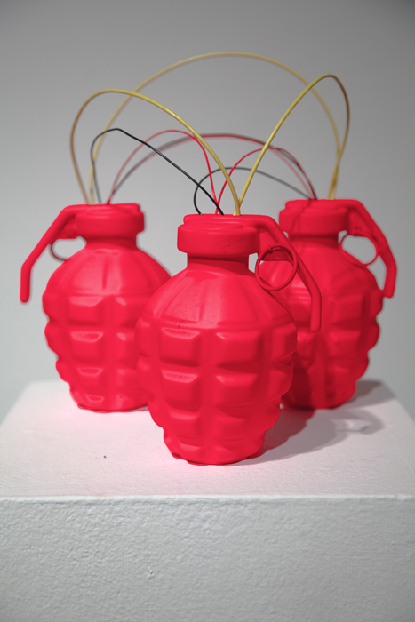
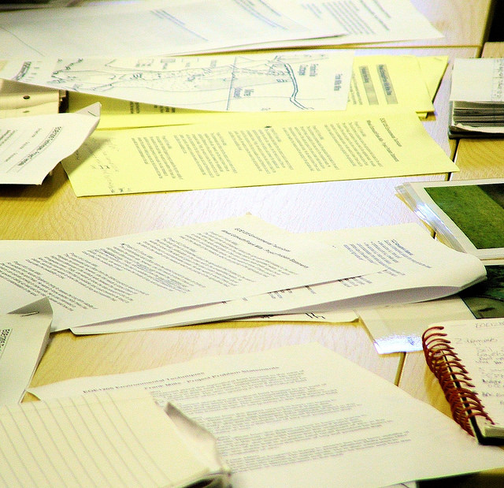
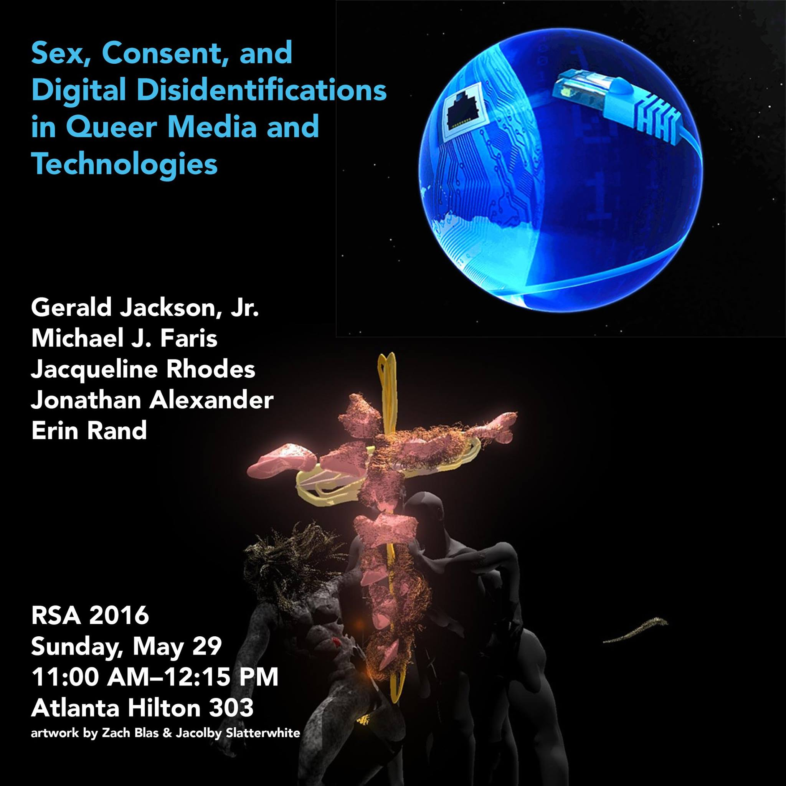
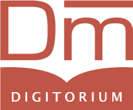
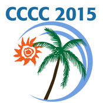

<h3>Projects and Publications</h3>

<figure>

<figcaption>Photo courtesy of Zach Blas</figcaption>
</figure>

My work broadly spans three different areas of study: rhetoric, digital media studies, and gender and sexuality studies. Across these areas, I argue that social and cultural norms, including gender norms, circulate through the writing and implementation of computer code. Specifically, my work connects gender, sexuality and computer code through theories of rhetoric and gender performativity to analyze how digital software shapes communicative networks and reiterates cultural values of gender, labor, and knowledge-making practices. 

In my dissertation, *Queer Epistemologies: Studies of Computational Performativity in Gendered Network Spaces*, I introduce the concept of computational performativity to explore how the underlying coding practices of software and digital networks reiterate and propagate cultural norms. I trace the movement of gendered practices of programming and knowledge-making through network protocols such as BitTorrent and Bitcoin to demonstrate how those practices proliferate through concealed processes underlying source code. I argue that computational performativity mirrors gender performativity in numerous ways, as each refers to the production of subjectivities, agencies, and bodies within spaces created by networks of discourse. A study of computational performativity introduces a study of what Nathan Stormer describes as a rhetoric of order, or the ways in which structure and organization beget new forms of discourse and persuasion. In making this argument, I outline a critical approach to code studies rooted in rhetoric and gender studies that demonstrates how code and coding practices circulate gendered assumptions not only through representation or linguistic interpretation but through the very logic and structure of code itself. My conclusions contribute to discussions of how technology shapes and circulates our values by locating a rhetorical capacity of code beyond source code. 

In addition to my dissertation, I am interested in the intersections of rhetorical media and gender, specifically the ways in which queer theories of agency and subjectivity illuminate how they co-constitute each other. My article, “Performance and Disidentification: Towards a Theory of Queer Modalities and Networked Communication,” published in *The Journal of Global Literacies, Technology, and Emerging Pedagogies*, studies computer code through the framework of José Munoz’s “disidentification.” Linking a queer practice of cultural agency like disidentification with code demonstrates how technology is never neutral and always open for rhetorical study as a gendered discourse. My work further comments on rhetoric and media through questions of circulation, as I study communication networks such as BitTorrent and Bitcoin to discuss how code and software function persuasively through performativity and order. Persuasive order performs the circulation of discourse, which has direct import for scholars of rhetoric, gender, and media.

  

<figure>

<figcaption>Photo Courtesy of Jason Truscott</figcaption>
</figure>
While my doctoral work is ostensibly focused on theories of rhetoric, media, and gender, I am also trained in writing pedagogy. My teaching incorporates my interest in media and critical theory, and I have taught successful classes in first year composition, basic writing, and professional and technical writing. Throughout all of these courses, I maintain a high level of rhetorical and analytical rigor while including multimodal and digital activities. My pedagogy seeks to cultivate a critical awareness of discourse and language through different media, and to encourage students to see the applicability of what they learn in the classroom through multiple communicative situations. I also served as Assistant Director of First Year English at USC for two years, where I helped edit the English 102 textbook, plan curriculum, and observe graduate instructors. My major task as Assistant Director involved managing a joint project between the English department and the Center for Digital Humanities. This project seeks to build a corpus of student papers from first-year classrooms for storage and analysis purposes. 

<h3>Future and Recent Presentations</h3>
<strong style="float: left; padding: 10px;">Mediation, Sexuality, and the Digital:  Towards Rhetorical Digital Disidentification   Rhetoric Society of America 2016   Atlanta, GA.
 

</strong>

Offering a performative media context for rhetoric, situated at the intersection of queer studies and media theory, Speaker 1 raises the question of “modality” as an extension and expansion of how scholars might approach the theorization of rhetorical agency. Beginning with the conversation of agency between Cheryl Geisler (2009) and Christian Lundberg and Joshua Gunn (2009) in the pages of Rhetoric Society Quarterly, Speaker 1 connects the central questions of that debate to further work in digital rhetoric tied to agency (Grabill and Pigg, Brooke, Rice). Then, studying queer activist Zach Blas’s digital piece “transCoder,” a speculative software development kit, Speaker 1 foregrounds the question of agency through a discussion of modality, specifically through the contours of Blas’s performative/computational work. Through a reading of queer theories of performance and embodied technics in Butler (1999), Julian Gil-Peterson (2014), and José Esteban Muñoz (1999) alongside Jussi Parikka’s (2011) materialist theory of media, a rhetorical performative media emerges from a framework of agential modality in which agency is a manifestation of the logics of mediation. transCoder, following Blas and queer theorist Muñoz’s, exemplifies a “digital disidentification,” a performative practice that recognizes the (sometimes paradoxical) registers of actions and effects that circulate through digital media. Speaker 1 suggests digital disidentification offers a way to understand and rework these channels of circulation at the level of the media itself. 
  

<strong style="float: right; text-align: right; width: 300px;">Pedagogy and Analytics:  The USC First Year Corpus  Digitorium 2016  Tuscaloosa, AL
 
</strong>

The First Year English program at the University of South Carolina at Columbia, in conjunction with the USC Center for Digital Humanities, is developing an application to gather, organize, and analyze a corpus of first-year student writing, structured around questions of revision and writing complexity. FYE Director Dr. Chris Holcomb and computer scientist Dr. Duncan Buell, along with CDH programmers, are currently developing algorithms to perform textual analysis on pairs of student papers to track changes between original drafts and final submissions, including any modifications in clause and phrase usage, sentence complexity, and overall structural reworking. I will present a report regarding the mission and goals of the project, as well as our plan for its implementation at USC and amongst partner schools, our timeline, how we intend to use this corpus as a heuristic for programmatic goals (including curriculum and teacher training), and how this will benefit teachers of English and Composition more broadly.
  

<strong style="float: left; padding: 10px; width: 250px;">Mediated Composition:  The Ethical Imperative of Performing with(in)
‘New’ Media  CCCC 2015  Tampa, FL
 

</strong>

Prior to the release of the iPhone 5c, a then-new, cheaper iPhone built with coloed plastic, a report issued by the investigative group China Labor Watch leaked information about the phone to the general public (which had, up until that point, been left with only rumors and speculation). The explosion of reporting on the phone was immediately entangled with questions of labor and human rights abuses, to the point where it quickly became apparent that our fascination with new communication technologies is inextricably linked to the ethical imperative of understanding our position in an economy of labor exploitation. This presentation asks how this is relevant to the writing class. As the field has, and continues to, shift towards writing in New Media platforms, how do we respond to the implication of our writing and teaching practices within a world of exploitative labor? How do we simultaneously posit new media as the future of rhetoric, civil engagment, and deliberation, when the very makeup of that future is one built on a network of global capital and stratification? When the technologies we situate as the grounds of a new political participation are rooted in incredibly non-democratic practices? And, finally, how do we recognize this as a pedagogial imperative? 
  

