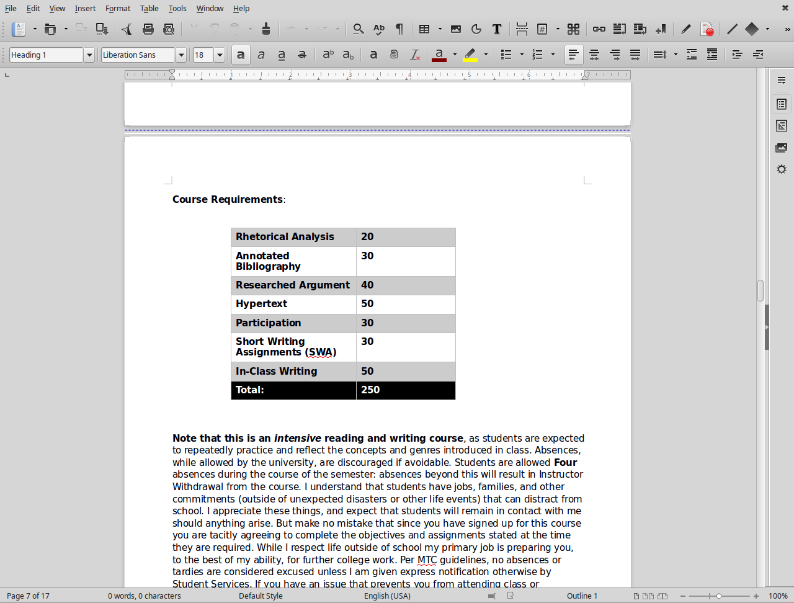
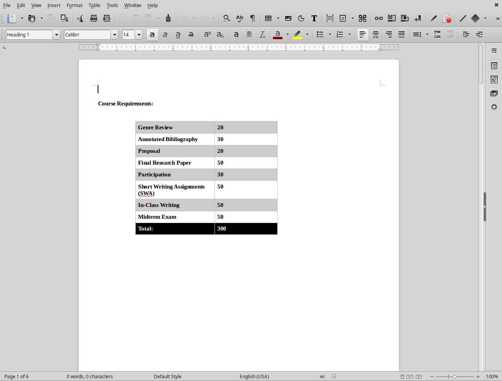

<strong style="float: left; padding: 10px;">English 463: Professional Writing
 

</strong>

This section of professional writing represents a broad overview of what I try to accomplish in the class. The course begins with a straightforward resume and cover-letter assignment that students turn in and continually revise over the course of the semester. I also include a professional description assignment in which they write a small, descriptive essay based on a topic in their professional field, with the goal of breaking it down for a layperson audience. I also include a web presense assignment in which students develop and cultivate a professional online persona through the development of a website, a Linkedin profile, and a Twitter account. Finally, students build a professional proposal anchored towards a product or proposed initiative. In some classes I have the gear proposals towards non-profit initiatives or initiatives centered on development of University programs. I have them create their proposals in Adobe InDesign, teaching them basics in a computer lab that they can use to create visually persuasive documents in a professional program. 
  

<strong style="float: right; width: 300px;">English 102: Research and Writing through Games and Play
 
</strong>

This section of English 102 was taught as a themed class for the USC Capstone program. I developed it around the idea of using rhetorical analysis to engage with the interfaces and elements of play that surround us all the time. Students learn the basics of rhetorical analysis and research that all first-year students engage with, but I model this analysis on the rhetoric of games and procedure. Drawing from thinkers like Huizinga, Calliois, and Foucault, students begin to think about the way play, games, and rules shape and discipline how we think and act. While I root this in a general practice of games and play, I tend to focus on the digital: reading Ian Bogost's theories of procedural rhetoric, we begin to talk about the disciplining work of games and software interfaces, which students engage as their objects of study. 
  

<strong style="float: left; padding: 10px; width: 250px;">English 102: Research and Writing through Documentary and Non-Fiction
 

</strong>

Another Capstone section of 102, this course situated the English department's commitment to teaching Rhetoric and Writing through questions of media, primarily focusing on non-fiction texts and movies. The question of "truth" as a representational and rhetorical technique came to the forefront as we read articles on war photoograph and the atomic bomb alongside Hunter S. Thompson's *Fear and Loathing in Las Vegas*, alongside documentary movies such as *Samsara*, *Super Size Me*, and *The Impostor.* Students committed their research to questions of how to articulate "truth" through academic language, personal narrative, and improvization techniqes coupled with the question of media representation and part of that articulation.
  

<strong style="float: right; padding: 10px; width: 250px;">English 101:Elite Deviance
 

</strong>

A themed course I taught at Southern Illinois University Edwardsville, the theme of this course focused on the concept of "Elite Deviance." Drawing the concept from David Simon's book *Elite Deviance*, this course used that text to interrogate our relationship with authority and our trust of that authority. Students began with studying their own recollections of authority, looking at both the negative and productive aspects of such relationships (and our ability to question authority). We leveraged a few key texts, and then began to investigate different scenarios in which authority becomes its own discourse and law. From Monsanto to American automobile production to conspiracy theory and the war in Iraq, we wrote and spoke about how these structures and institutions function as authority, and how we begin to investigate them. 
  

<h3 style="text-align: center;">General Courses</h3>

	
	

		
	
	
	 
	

	This is a more generalized course syllabus for English 101. I use this as a template for other courses. It focuses more broadly on rhetorical analysis, critical orientations to events or objects of study, and making claims with researched support.
	
	

	

	
	
	 
	

	This is a more generalized course syllabus for English 102. I use this as a template for other ocurses. It focuses more broadly on questions of genre and medium related to claim making and research, with a heavy emphasis on individual and collaborative writing. 
	

