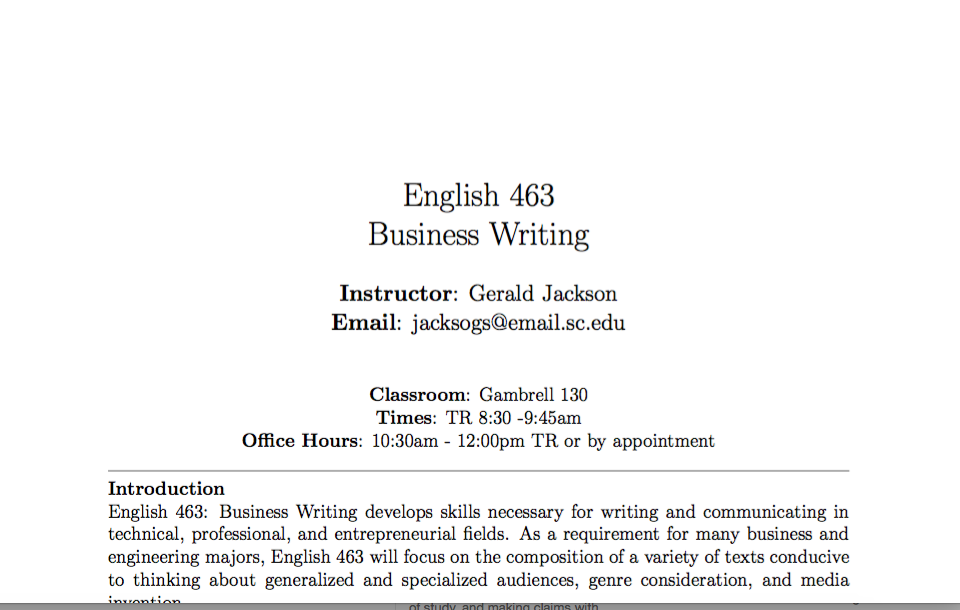
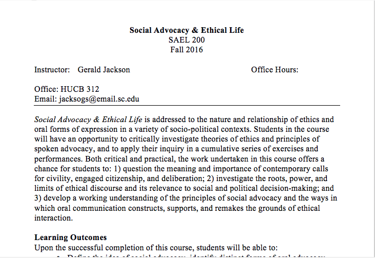
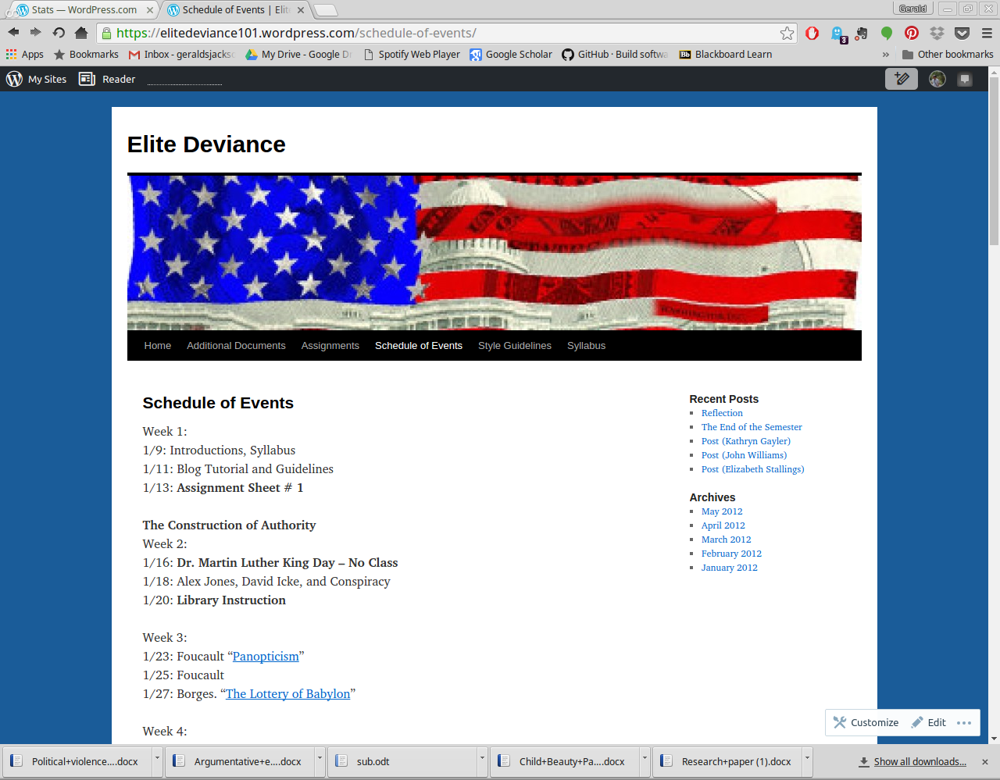
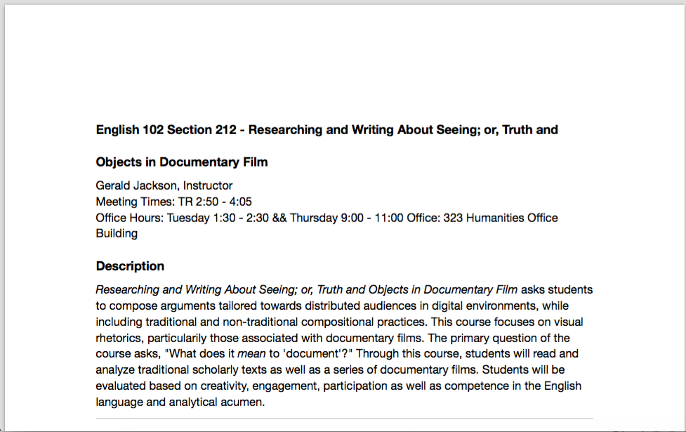
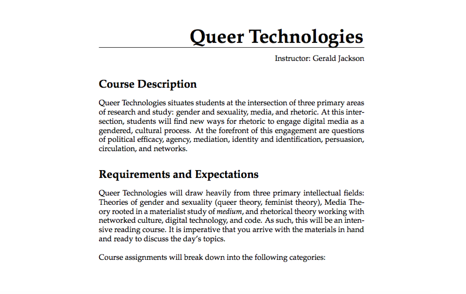

<h3 style="text-align: center;">Past and Current Courses</h3>

	

		
		<strong>English 463: Professional Writing</strong>  This syllabus is for my Professional Writing course. This latest version contains the basic template for the course that I use, including a simple map for Adobe InDesign lessons. 
	
	

	
	

		
		<strong>SAEL 200: Social Advocacy and Ethical Life</strong> This syllabus represents the departmental requirements for SAEL 200: Social  Advocacy and Ethical Life. The schedule is my interpretation of the SAEL program learning outcomes.
	

	

		
		<strong>English 102: Rhetoric of Play</strong> This Capstone section of English 102 taught the basics of rhetorical analysis and research through games and software interfaces.
	
	

	
	

		
		<strong>English 101: Elite Deviance</strong> This was a specialty course taught at SIUE focused on research and argument related to students' relationship with authority. 
		
		

		
		<strong>English 102: Rhetoric in Documentary</strong>  Another Capstone focused on truth, persuasion, and documentary/non-fiction.
	    
	

	
	
	

<h3 style="text-align: center;">Future Courses</h3>

		
		<strong>Queer Technologies</strong>  Theoretical graduate course in the works, derived from my dissertation and focused on conversations between queer theory and sexuality, digital media, and rhetoric. 
	
	

	

   
